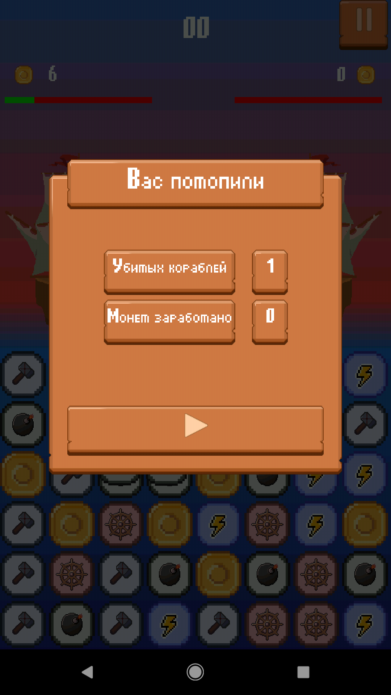
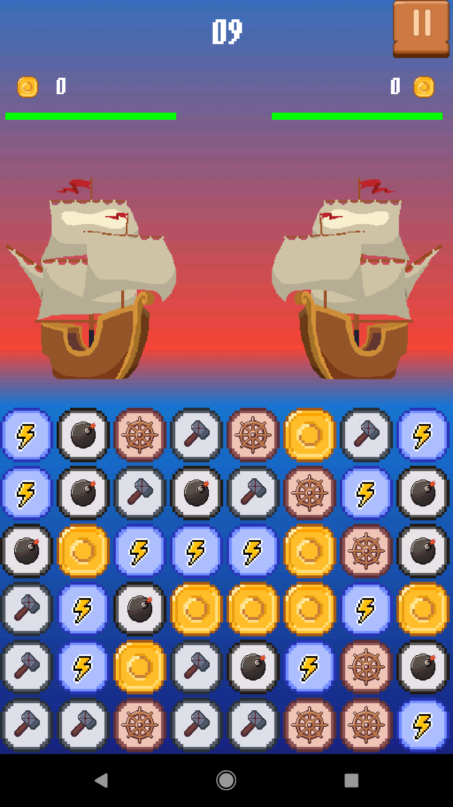
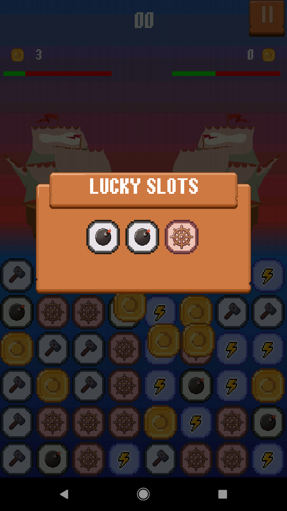

## Pirates Adventure

### Match - 5 game
  

#### Mechanics:
- Every 10 earned coins trigger slot machine
- Bombs deal damage to defender's ship
- Repair tiles restore 1hp for each tile
- Evasion allows receive not all damage
- Special ability tiles not implemented
- If timer expired turn goes to opposite player

#### Features
- Running on Android and Ios
- Implemented tiles move animations
- Bomb move animation
- Receiving damage animation
- Partitioned ship rendering
- Single skin class (DefaultSkin)

#### Used:
- LibGDX
- Ashley (ECS)
- GDX Texture Packer
- Aseprite